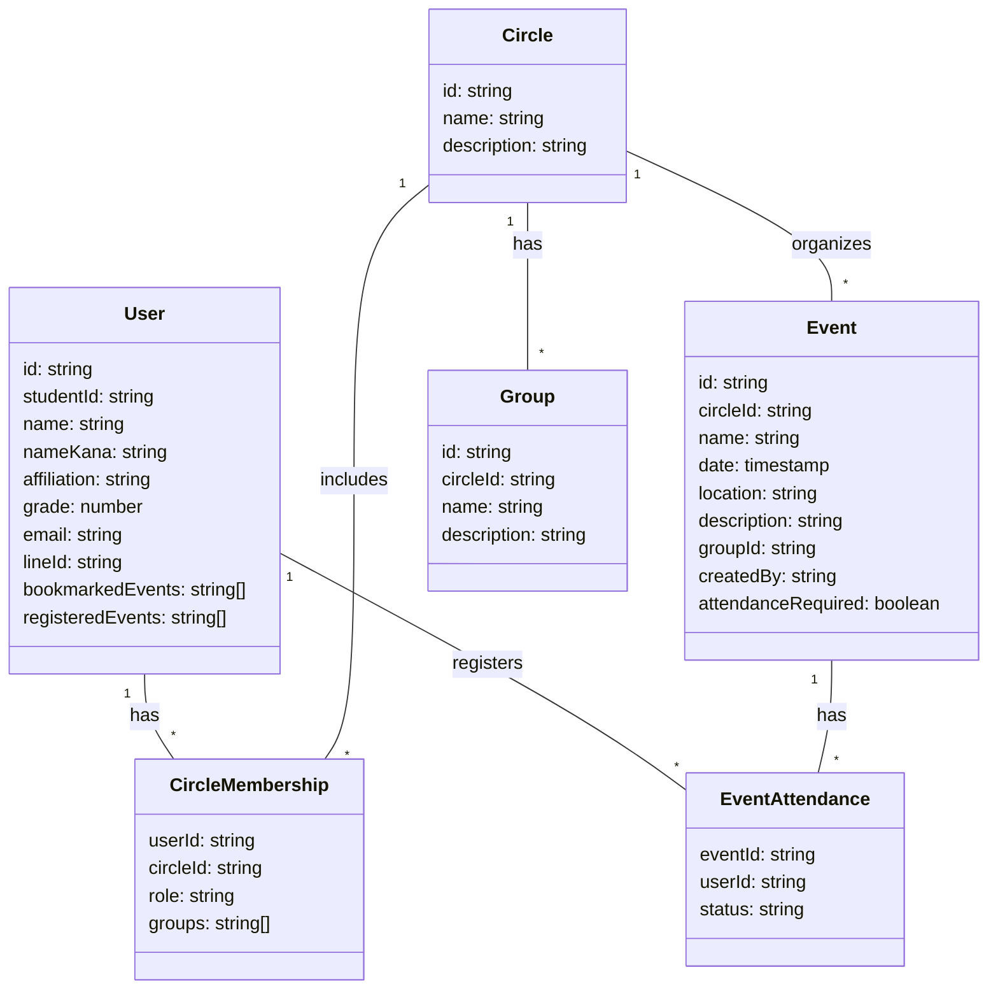

# サークル管理アプリ ドキュメント

## 概要
このアプリは、ユーザーがサークルを作成し、イベントを管理するためのプラットフォームです。ユーザーはサークルに参加し、イベントを作成・管理することができます。

## 技術スタック
- **フロントエンド**: React, TypeScript, Vite
- **バックエンド**: Ruby on Rails, Firebase
- **データベース**: Firestore

## 機能
### ユーザー認証
- ユーザーはメールアドレスとパスワードで登録・ログインできます。
- メール認証機能があります。

### サークル管理
- ユーザーは新しいサークルを作成できます。
- 招待コードを使用して他のユーザーをサークルに招待できます。
- サークルのメンバーシップを管理できます。

### イベント管理
- サークル内でイベントを作成・管理できます。
- イベントには日付、時間、場所、説明を設定できます。
- 出席登録が必要なイベントを作成できます。

### グループ管理
- サークル内でグループを作成し、管理できます。
- ユーザーはグループに参加し、イベントに関連付けることができます。

## フロントエンド構成
### ページ一覧
- **ログインページ**: ユーザーがログインするためのページ。
- **登録ページ**: 新規ユーザーがアカウントを作成するためのページ。
- **マイページ**: ユーザーのプロフィール情報と所属サークルを表示。
- **サークル作成ページ**: 新しいサークルを作成するためのページ。
- **イベント作成ページ**: 新しいイベントを作成するためのページ。
- **ダッシュボード**: ユーザーが参加しているイベントやサークルを表示。

### コンポーネント
- **ボタン**: アプリ全体で使用されるボタンコンポーネント。
- **カード**: 情報を表示するためのカードコンポーネント。
- **ダイアログ**: 確認メッセージや情報を表示するためのダイアログコンポーネント。

### 主要なコードスニペット

#### サークル作成ページ
```typescript
import React, { useState } from 'react';
import { useNavigate } from 'react-router-dom';
import { db, auth } from '../../firebaseConfig';
import { collection, addDoc, doc, setDoc } from 'firebase/firestore';
import { Button } from "@/components/ui/button";
import { Input } from "@/components/ui/input";
import { Textarea } from "@/components/ui/textarea";
import { Label } from "@/components/ui/label";
import { Alert, AlertDescription, AlertTitle } from "@/components/ui/alert";
import { Dialog, DialogContent, DialogDescription, DialogFooter, DialogHeader, DialogTitle } from "@/components/ui/dialog";
import { X } from 'lucide-react';
import { useCircle } from '../../CircleContext';

const CreateCirclePage: React.FC = () => {
  const [circleName, setCircleName] = useState('');
  const [circleDescription, setCircleDescription] = useState('');
  const [groups, setGroups] = useState<string[]>([]);
  const [newGroup, setNewGroup] = useState('');
  const [error, setError] = useState<string | null>(null);
  const [invitationCode, setInvitationCode] = useState<string | null>(null);
  const [isConfirmDialogOpen, setIsConfirmDialogOpen] = useState(false);
  const navigate = useNavigate();
  const { setActiveCircle } = useCircle();

  const generateInvitationCode = () => {
    return Math.random().toString(36).substring(2, 8).toUpperCase();
  };

  const handleSubmit = (e: React.FormEvent) => {
    e.preventDefault();
    setIsConfirmDialogOpen(true);
  };

  const createCircle = async () => {
    const user = auth.currentUser;
    if (!user) {
      setError('ログインしてください。');
      return;
    }

    try {
      const code = generateInvitationCode();
      const circleDocRef = await addDoc(collection(db, 'circles'), {
        name: circleName,
        description: circleDescription,
        createdBy: user.uid,
        createdAt: new Date(),
        invitationCode: code
      });

      await setDoc(doc(db, 'circleMemberships', `${user.uid}_${circleDocRef.id}`), {
        userId: user.uid,
        circleId: circleDocRef.id,
        role: 'admin',
        joinedAt: new Date()
      });

      for (const group of groups) {
        await addDoc(collection(db, 'groups'), {
          name: group,
          circleId: circleDocRef.id,
          createdAt: new Date()
        });
      }

      setInvitationCode(code);
      setActiveCircle({ id: circleDocRef.id, name: circleName });
    } catch (error) {
      console.error("Error creating circle: ", error);
      setError('サークルの作成に失敗しました。もう一度お試しください。');
    }
    setIsConfirmDialogOpen(false);
  };

  const addGroup = () => {
    if (newGroup.trim() !== '') {
      setGroups([...groups, newGroup.trim()]);
      setNewGroup('');
    }
  };

  const removeGroup = (indexToRemove: number) => {
    setGroups(groups.filter((_, index) => index !== indexToRemove));
  };

  return (
    <div className="max-w-2xl mx-auto p-4">
      <h2 className="text-2xl font-bold mb-4">サークル作成</h2>
      {error && (
        <Alert variant="destructive" className="mb-4">
          <AlertTitle>エラー</AlertTitle>
          <AlertDescription>{error}</AlertDescription>
        </Alert>
      )}
      {invitationCode ? (
        <div className="mb-4">
          <Alert>
            <AlertTitle>サークルが作成されました！</AlertTitle>
            <AlertDescription>
              招待コード: <strong>{invitationCode}</strong><br />
              このコードを他のメンバーに共有して、サークルに招待してください。
            </AlertDescription>
          </Alert>
          <Button onClick={() => navigate('/')} className="mt-4">ダッシュボードへ戻る</Button>
        </div>
      ) : (
        <form onSubmit={handleSubmit} className="space-y-4">
          <div>
            <Label htmlFor="circleName">サークル名</Label>
            <Input
              id="circleName"
              value={circleName}
              onChange={(e) => setCircleName(e.target.value)}
              required
            />
          </div>
          <div>
            <Label htmlFor="circleDescription">サークル説明</Label>
            <Textarea
              id="circleDescription"
              value={circleDescription}
              onChange={(e) => setCircleDescription(e.target.value)}
              required
            />
          </div>
          <div>
            <Label htmlFor="newGroup">グループ追加（任意）</Label>
            <div className="flex space-x-2">
              <Input
                id="newGroup"
                value={newGroup}
                onChange={(e) => setNewGroup(e.target.value)}
                placeholder="新しいグループ名"
              />
              <Button type="button" onClick={addGroup}>追加</Button>
            </div>
          </div>
          {groups.length > 0 && (
            <div>
              <Label>追加されたグループ</Label>
              <ul className="space-y-2">
                {groups.map((group, index) => (
                  <li key={index} className="flex items-center justify-between bg-gray-100 p-2 rounded">
                    <span>{group}</span>
                    <Button 
                      type="button"
                      variant="ghost" 
                      size="sm"
                      onClick={() => removeGroup(index)}
                    >
                      <X className="h-4 w-4" />
                    </Button>
                  </li>
                ))}
              </ul>
            </div>
          )}
          <Button type="submit">サークルを作成</Button>
        </form>
      )}
      <Dialog open={isConfirmDialogOpen} onOpenChange={setIsConfirmDialogOpen}>
        <DialogContent>
          <DialogHeader>
            <DialogTitle>サークル作成の確認</DialogTitle>
            <DialogDescription>
              以下の内容でサークルを作成します。よろしいですか？
            </DialogDescription>
          </DialogHeader>
          <div className="py-4">
            <p><strong>サークル名:</strong> {circleName}</p>
            <p><strong>説明:</strong> {circleDescription}</p>
            {groups.length > 0 && (
              <div>
                <strong>グループ:</strong>
                <ul className="list-disc list-inside">
                  {groups.map((group, index) => (
                    <li key={index}>{group}</li>
                  ))}
                </ul>
              </div>
            )}
          </div>
          <DialogFooter>
            <Button variant="outline" onClick={() => setIsConfirmDialogOpen(false)}>キャンセル</Button>
            <Button onClick={createCircle}>確定して作成</Button>
          </DialogFooter>
        </DialogContent>
      </Dialog>
    </div>
  );
};
```

#### サークル管理ページ
```typescript
import React, { useState, useEffect } from 'react';
import { useParams } from 'react-router-dom';
import { db } from '../firebaseConfig';
import { collection, doc, getDoc, getDocs, updateDoc, addDoc, query, where } from 'firebase/firestore';
import { Button } from "@/components/ui/button";
import { Input } from "@/components/ui/input";
import { Select, SelectContent, SelectItem, SelectTrigger, SelectValue } from "@/components/ui/select";
import { Table, TableBody, TableCell, TableHead, TableHeader, TableRow } from "@/components/ui/table";

interface Member {
  id: string;
  name: string;
  role: string;
  groups: string[];
}

interface Group {
  id: string;
  name: string;
}

const CircleManagementPage: React.FC = () => {
  const { circleId } = useParams();
  const [circleName, setCircleName] = useState('');
  const [invitationCode, setInvitationCode] = useState('');
  const [members, setMembers] = useState<Member[]>([]);
  const [groups, setGroups] = useState<Group[]>([]);
  const [error, setError] = useState<string | null>(null);

  useEffect(() => {
    const fetchCircleData = async () => {
      if (!circleId) {
        setError("サークルIDが指定されていません。");
        return;
      }

      try {
        const circleDoc = await getDoc(doc(db, 'circles', circleId));
        if (circleDoc.exists()) {
          setCircleName(circleDoc.data().name);
          setInvitationCode(circleDoc.data().invitationCode || 'N/A');
        } else {
          setError("指定されたサークルが見つかりません。");
          return;
        }

        const membershipsQuery = query(collection(db, 'circleMemberships'), where("circleId", "==", circleId));
        const membershipsSnapshot = await getDocs(membershipsQuery);
        const membersData: Member[] = [];

        for (const membershipDoc of membershipsSnapshot.docs) {
          const userData = await getDoc(doc(db, 'users', membershipDoc.data().userId));
          if (userData.exists()) {
            membersData.push({
              id: userData.id,
              name: `${userData.data().lastName} ${userData.data().firstName}`,
              role: membershipDoc.data().role,
              groups: membershipDoc.data().groups || []
            });
          }
        }
        setMembers(membersData);

        const groupsQuery = query(collection(db, 'groups'), where("circleId", "==", circleId));
        const groupsSnapshot = await getDocs(groupsQuery);
        const groupsData = groupsSnapshot.docs.map(doc => ({ id: doc.id, name: doc.data().name }));
        setGroups(groupsData);

      } catch (err) {
        console.error("Error fetching circle data:", err);
        setError("サークル情報の取得中にエラーが発生しました。");
      }
    };

    fetchCircleData();
  }, [circleId]);

  const handleRoleChange = async (memberId: string, newRole: string) => {
    try {
      const membershipQuery = query(
        collection(db, 'circleMemberships'),
        where("circleId", "==", circleId),
        where("userId", "==", memberId)
      );
      const membershipSnapshot = await getDocs(membershipQuery);
      if (!membershipSnapshot.empty) {
        const membershipDoc = membershipSnapshot.docs[0];
        await updateDoc(doc(db, 'circleMemberships', membershipDoc.id), { role: newRole });
        setMembers(members.map(member => 
          member.id === memberId ? { ...member, role: newRole } : member
        ));
      }
    } catch (err) {
      console.error("Error updating role:", err);
      setError("ロールの更新中にエラーが発生しました。");
    }
  };

  const handleAddGroup = async () => {
    const newGroupName = prompt("新しいグループ名を入力してください:");
    if (!newGroupName) return;
    try {
      const newGroupRef = await addDoc(collection(db, 'groups'), {
        name: newGroupName,
        circleId: circleId
      });
      setGroups([...groups, { id: newGroupRef.id, name: newGroupName }]);
    } catch (err) {
      console.error("Error adding group:", err);
      setError("グループの追加中にエラーが発生しました。");
    }
  };

  if (error) {
    return <div className="container mx-auto p-4">{error}</div>;
  }

  return (
    <div className="container mx-auto p-4">
      <h1 className="text-2xl font-bold mb-4">サークル管理: {circleName}</h1>
      <p className="mb-4">招待コード: {invitationCode}</p>
      {error && <div className="text-red-500 mb-4">{error}</div>}
      
      <h2 className="text-xl font-semibold mb-2">メンバー一覧</h2>
      <Table>
        <TableHeader>
          <TableRow>
            <TableHead>名前</TableHead>
            <TableHead>ロール</TableHead>
            <TableHead>グループ</TableHead>
          </TableRow>
        </TableHeader>
        <TableBody>
          {members.map(member => (
            <TableRow key={member.id}>
              <TableCell>{member.name}</TableCell>
              <TableCell>
                <Select value={member.role} onValueChange={(value) => handleRoleChange(member.id, value)}>
                  <SelectTrigger>
                    <SelectValue placeholder="ロールを選択" />
                  </SelectTrigger>
                  <SelectContent>
                    <SelectItem value="admin">管理者</SelectItem>
                    <SelectItem value="member">メンバー</SelectItem>
                  </SelectContent>
                </Select>
              </TableCell>
              <TableCell>
                {groups.map(group => (
                  <label key={group.id} className="flex items-center space-x-2">
                    <input
                      type="checkbox"
                      checked={member.groups.includes(group.id)}
                      onChange={() => handleGroupToggle(member.id, group.id)}
                    />
                    <span>{group.name}</span>
                  </label>
                ))}
              </TableCell>
            </TableRow>
          ))}
        </TableBody>
      </Table>

      <h2 className="text-xl font-semibold my-4">新しいグループの追加</h2>
      <div className="flex space-x-2">
        <Input
          value={newGroupName}
          onChange={(e) => setNewGroupName(e.target.value)}
          placeholder="新しいグループ名"
        />
        <Button onClick={handleAddGroup}>追加</Button>
      </div>
    </div>
  );
};
```

### バックエンド構成
#### Gemfile
```gemfile
source "https://rubygems.org"

ruby "3.3.4"

gem "rails", "~> 7.1.3", ">= 7.1.3.4"
gem "sqlite3", "~> 1.4"
gem "puma", ">= 5.0"
gem 'firebase-admin'
gem 'firebase-admin-sdk'
gem 'google-cloud-firestore'
gem "bootsnap", require: false
```

#### CORS設定
```rb
Rails.application.config.middleware.insert_before 0, Rack::Cors do
  allow do
    origins 'http://localhost:5173'  # フロントエンドのオリジンを指定
    resource '*',
      headers: :any,
      methods: [:get, :post, :put, :patch, :delete, :options, :head]
  end
end
```


### データベース構造
#### Firestoreコレクション
- **users**: ユーザー情報を格納。
- **circles**: サークル情報を格納。
- **events**: イベント情報を格納。
- **groups**: グループ情報を格納。
- **circleMemberships**: ユーザーのサークルメンバーシップ情報を格納。


## 開発環境のセットアップ
1. リポジトリをクローンします。
2. フロントエンドの依存関係をインストールします。
   ```bash
   cd frontend
   npm install
   ```
3. バックエンドの依存関係をインストールします。
   ```bash
   cd backend
   bundle install
   ```
4. Firebaseの設定を行い、必要な環境変数を設定します。
5. アプリを起動します。
   - フロントエンド: `npm run dev`
   - バックエンド: `rails server`

## 注意事項
- 環境変数やAPIキーは、セキュリティのために適切に管理してください。
- データベースのスキーマやAPIの仕様は、今後のアップデートにより変更される可能性があります。

## ライセンス
このプロジェクトはMITライセンスの下で公開されています。詳細はLICENSEファイルを参照してください。